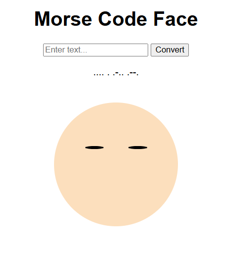

# Morse Code Blinking Face App 

##  Overview

This project is a Flask-based web application that converts user-input text into Morse code and visualizes it using an animated blinking face.

Each dot (`.`) and dash (`-`) is represented by short and long eye blinks, creating an interactive and engaging way to experience Morse code.

---

##  Preview

### Eyes Closed (Blinking)



### Eyes Open


---

##  Features

* Convert text into Morse code
* Animated blinking visualization (dots and dashes)
* Clean and interactive user interface
* Handles unsupported characters gracefully
* Lightweight and easy to run locally

---

##  Tech Stack

* Python (Flask)
* HTML
* CSS
* JavaScript

---

##  How to Run (Step-by-Step Guide)

### 1. Install Python

* Download Python from: https://www.python.org/downloads/
* During installation, make sure to check:
   **"Add Python to PATH"**

---

### 2. Install Git

* Download Git from: https://git-scm.com/downloads
* Install with default settings

---

### 3. Open Command Prompt (Windows)

Press:

* `Windows Key + R`
* Type:

```bash
cmd
```

* Press Enter

---

### 4. Clone the Repository

In the Command Prompt, type:

```bash
git clone https://github.com/AeroSeif/morse-code-flask-app.git
```

---

### 5. Navigate into the Project Folder

```bash
cd morse-code-flask-app
```

---

### 6. Install Required Libraries

```bash
pip install flask
```


```bash
pip install -r requirements.txt
```

---

### 7. Run the Application

```bash
python app.py
```

---

### 8. Open in Browser

Go to:

```text
http://127.0.0.1:5000
```

---

 You should now see the Morse Code Face app running with blinking animation.

---

## Future Improvements

* Add Morse code sound (beep tones)
* Reverse conversion (Morse → Text)
* Improve UI/UX design (animations, styling)
* Deploy the application online (e.g., Render or Railway)

---

## Author

**Seif**
Freelance Engineering & Data Projects 

---

## Acknowledgements

* Inspired by the Morse Code system: https://en.wikipedia.org/wiki/Morse_code
